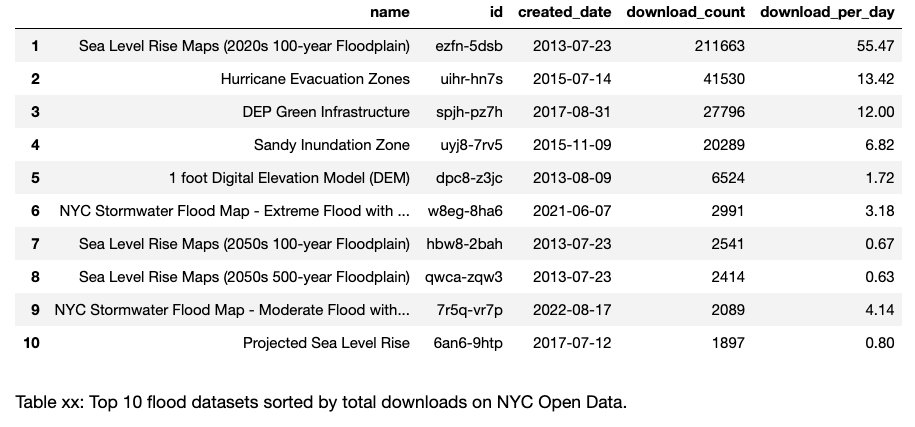
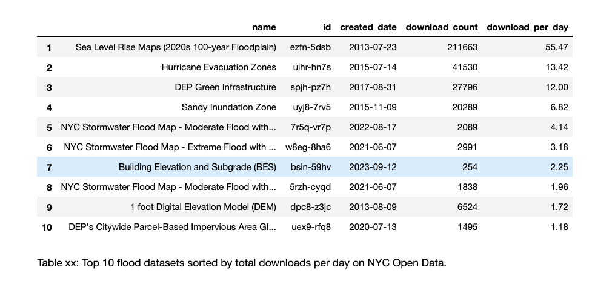
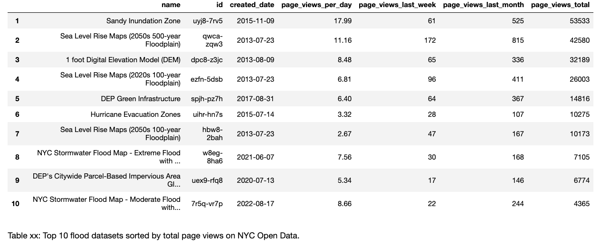

# Flood Data for New York City

## Flood Datasets
### Flood Hazard Layers
| Dataset | Description |
| :-------- | :---------- |
| [Hurricane Evacuation Zones](https://data.cityofnewyork.us/Public-Safety/Hurricane-Evacuation-Zones/uihr-hn7s) | Hurricane Evacuation Zones are determined by New York City Emergency Management and represent varying threat levels of coastal flooding resulting from storm surge. Hurricane evacuation zones should not be confused with flood insurance risk zones, which are designated by FEMA and available in the form of Flood Insurance Rate Maps (FIRMs). |
| [Sandy Inundation Zone](https://data.cityofnewyork.us/Environment/Sandy-Inundation-Zone/uyj8-7rv5) | Areas of New York City that were flooded as a result of Hurricane Sandy. |
| [NYC Stormwater Flood Map - Moderate Flood with Current Sea Levels](https://data.cityofnewyork.us/Environment/NYC-Stormwater-Flood-Map-Moderate-Flood-with-Curre/7r5q-vr7p) | Citywide Geographic Information System (GIS) layer that shows areas of potential flooding under the Moderate Stormwater Flood with Current Sea Levels scenario. Please see the New York City Stormwater Resiliency Plan for more information. |
| [NYC Stormwater Flood Map - Moderate Flood with 2050 Sea Level Rise](https://data.cityofnewyork.us/City-Government/NYC-Stormwater-Flood-Map-Moderate-Flood-with-2050-/5rzh-cyqd) | Citywide Geographic Information System (GIS) layer that shows areas of potential flooding under the Moderate Stormwater Flood with 2050 Sea Level Rise scenario. Please see the New York City Stormwater Resiliency Plan for more information. |
| [NYC Stormwater Flood Map - Extreme Flood with 2080 Sea Level Rise](https://data.cityofnewyork.us/City-Government/NYC-Stormwater-Flood-Map-Extreme-Flood-with-2080-S/w8eg-8ha6) | Citywide Geographic Information System (GIS) layer that shows areas of potential flooding under the Extreme Stormwater Flood with 2080 Sea Level Rise scenario. Please see the New York City Stormwater Resiliency Plan for more information. |
| [Projected Sea Level Rise](https://data.cityofnewyork.us/City-Government/Projected-Sea-Level-Rise/6an6-9htp) | Geodatabase of projected sea level rise based on models released by New York City Panel on Climate Change (NPCC). Data includes the 10th, 25th, 50th, 75th and 90th percentile projections for the years 2020, 2050, 2080 and 2100. |
| [Sea Level Rise Maps (2020s 100-year Floodplain](https://data.cityofnewyork.us/Environment/Sea-Level-Rise-Maps-2020s-100-year-Floodplain-/ezfn-5dsb) | This is the 100-Year Floodplain for the 2020s based on FEMA's Preliminary Work Map data and the New York Panel on Climate Change's 90th Percentile Projects for Sea-Level Rise (11 inches). Please see the Disclaimer PDF for more information. Data Provided by the Mayor's Office of Long-Term Planning and Sustainability (OLTPS) on behalf of CUNY Institute for Sustainable Cities (CISC) and the New York Panel on Climate Change (NPCC). |
| [Sea Level Rise Maps (2020s 500-year Floodplain)](https://data.cityofnewyork.us/Environment/Sea-Level-Rise-Maps-2020s-500-year-Floodplain-/ajyu-7sgg) | This is the 500-Year Floodplain for the 2020s based on FEMA's Preliminary Work Map data and the New York Panel on Climate Change's 90th Percentile Projects for Sea-Level Rise (11 inches). Please see the Disclaimer PDF for more information. Data Provided by the Mayor's Office of Long-Term Planning and Sustainability (OLTPS) on behalf of CUNY Institute for Sustainable Cities (CISC) and the New York Panel on Climate Change (NPCC). |
| [Sea Level Rise Maps (2050s 100-year Floodplain](https://data.cityofnewyork.us/Environment/Sea-Level-Rise-Maps-2050s-100-year-Floodplain-/hbw8-2bah) | This is the 100-Year Floodplain for the 2050s based on FEMA's Preliminary Work Map data and the New York Panel on Climate Change's 90th Percentile Projects for Sea-Level Rise (31 inches). Please see the Disclaimer PDF for more information. Data Provided by the Mayor's Office of Long-Term Planning and Sustainability (OLTPS) on behalf of CUNY Institute for Sustainable Cities (CISC) and the New York Panel on Climate Change (NPCC). |
| [Sea Level Rise Maps (2050s 500-year Floodplain)](https://data.cityofnewyork.us/Environment/Sea-Level-Rise-Maps-2050s-500-year-Floodplain-/qwca-zqw3) | This is the 500-Year Floodplain for the 2050s based on FEMA's Preliminary Work Map data and the New York Panel on Climate Change's 90th Percentile Projects for Sea-Level Rise (31 inches). Please see the Disclaimer PDF for more information. Data Provided by the Mayor's Office of Long-Term Planning and Sustainability (OLTPS) on behalf of CUNY Institute for Sustainable Cities (CISC) and the New York Panel on Climate Change (NPCC). |
| [2050s Mean Sea Level](https://data.cityofnewyork.us/Environment/2050s-Mean-Sea-Level/3vjp-ybhy) | 2050s Future Mean Sea Level projections released by the NPCC March 2019. |
| [2080s Mean Sea Level](https://data.cityofnewyork.us/Environment/2080s-Mean-Sea-Level/cyvg-fsk8) | 2080s Future Mean Sea Level projections released by the NPCC March 2019. |
| [2100s Mean Sea Level](https://data.cityofnewyork.us/Environment/2100s-Mean-Sea-Level/q7rf-ks4h) | 2100s Future Mean Sea Level projections released by the NPCC March 2019. |
| [2020s Mean Monthly High Water](https://data.cityofnewyork.us/Environment/2020s-Mean-Monthly-High-Water/ebsy-4b6x) | 2020s Future Mean Monthly High Water (MMHW) projections released by the NPCC March 2019. |
| [2050s Mean Monthly High Water](https://data.cityofnewyork.us/Environment/2050s-Mean-Monthly-High-Water/p8e8-yh4m) | 2050s Future Mean Monthly High Water (MMHW) projections released by the NPCC March 2019. |
| [2080s Mean Monthly High Water](https://data.cityofnewyork.us/Environment/2080s-Mean-Monthly-High-Water/amfa-s2y8) | 2080s Future Mean Monthly High Water (MMHW) projections released by the NPCC March 2019. |
| [2100s Mean Monthly High Water](https://data.cityofnewyork.us/Environment/2100s-Mean-Monthly-High-Water/mzds-2cdc) | 2100s Future Mean Monthly High Water (MMHW) projections released by the NPCC March 2019. |

### Additional Data Related to Flood Risk
| Dataset | Description |
| :-------- | :---------- |
| [Building Elevation and Subgrade (BES)](https://data.cityofnewyork.us/City-Government/Building-Elevation-and-Subgrade-BES-/bsin-59hv) | The Building Elevation and Subgrade data contains New York City building centroids derived from the Department of Building's (DOB) February 26th, 2022 building footprint dataset. Each record contains a grade and first floor measurement for each building (recorded as feet above sea-level in the NADV88 vertical datum) and indicates if subgrade space exists. DCP contracted with an external data vendor to generate a single point, or centroid, that represented the location of the center of every building recorded in the DOB dataset. The dataset excluded the footprints of small accessory buildings such as sheds. Each row within the dataset represents one building centroid, and records the X and Y coordinates of that centroid in the NAD 1983 coordinate system. |
| [DEP Green Infrastructure](https://data.cityofnewyork.us/Environment/DEP-Green-Infrastructure/spjh-pz7h) | NYC Green Infrastructure Program initiatives. Green infrastructure (GI) collects stormwater from streets, sidewalks, and other hard surfaces before it can enter the sewer system or cause local flooding. The GI practice data contained in this dataset includes the location, program area, status, and type of GI.
Please visit nyc.gov/dep/gimap to view the DEP Green Infrastructure Map. |
| [311 Service Requests from 2010 to Present](https://data.cityofnewyork.us/Social-Services/311-Service-Requests-from-2010-to-Present/erm2-nwe9) | All 311 Service Requests from 2010 to present. This information is automatically updated daily. One of the descriptors is Street Flooding. |
| [1 foot Digital Elevation Model (DEM)](https://data.cityofnewyork.us/City-Government/1-foot-Digital-Elevation-Model-DEM-/dpc8-z3jc) | NYC 1foot Digital Elevation Model: A bare-earth, hydro-flattened, digital-elevation surface model derived from 2010 Light Detection and Ranging (LiDAR) data. Surface models are raster representations derived by interpolating the LiDAR point data to produce a seamless gridded elevation data set. A Digital Elevation Model (DEM) is a surface model generated from the LiDAR returns that correspond to the ground with all buildings, trees and other above ground features removed. The cell values represent the elevation of the ground relative to sea level. The DEM was generated by interpolating the LiDAR ground points to create a 1 foot resolution seamless surface. Cell values correspond to the ground elevation value (feet) above sea level. A proprietary approach to surface model generation was developed that reduced spurious elevation values in areas where there were no LiDAR returns, primarily beneath buildings and over water. This was combined with a detailed manual QA/QC process, with emphasis on accurate representation of docks and bare-earth within 2000ft of the water bodies surrounding each of the five boroughs. Please see the following link for additional documentation- https://github.com/CityOfNewYork/nyc-geo-metadata/blob/master/Metadata/Metadata_DigitalElevationModel.md |
| [DEP's Citywide Parcel-Based Impervious Area GIS Study](https://data.cityofnewyork.us/City-Government/DEP-s-Citywide-Parcel-Based-Impervious-Area-GIS-St/uex9-rfq8) | NOTE: This file includes data for all 5 boroughs and has a size of 4.60 GB. Individual borough files are available for download from the metadata attachments section. Citywide Geographic Information System (GIS) land cover layer that displays land cover classification, plus pervious and impervious area and percentage at the parcel level, separated into 5 geodatabases, one per borough. DEP hosted a webinar on this study on June 23, 2020. A recording of the webinar, plus a PDF of the webinar presentation, accompany this dataset and are available for download. Please direct questions and comments to DEP at imperviousmap@dep.nyc.gov. This citywide parcel-level impervious area GIS layer was developed by the City of New York to support stormwater-related planning, and is provided solely for informational purposes. The accuracy of the data should be independently verified for any other purpose. The City disclaims any liability for errors and makes no warranties express or implied, including, but not limited to, implied warranties of merchantability and fitness for a particular purpose as to the quality, content, accuracy or completeness of the information, text graphics, links and other items contained in this GIS layer. |
| [Building Footprints](https://data.cityofnewyork.us/Housing-Development/Building-Footprints/nqwf-w8eh) | Shapefile of footprint outlines of buildings in New York City. Please see the following link for additional documentation- https://github.com/CityOfNewYork/nyc-geo-metadata/blob/master/Metadata/Metadata_BuildingFootprints.md |
| [Primary Land Use Tax Lot Output - Map (MapPLUTO)](https://data.cityofnewyork.us/City-Government/Primary-Land-Use-Tax-Lot-Output-Map-MapPLUTO-/f888-ni5f) | Extensive land use and geographic data at the tax lot level in GIS format (ESRI Shapefile). Contains more than seventy fields derived from data maintained by city agencies, merged with tax lot features from the Department of Finance’s Digital Tax Map, clipped to the shoreline. |

## Say Hello!
Contact information:  
Twitter: [markbauerwater](https://twitter.com/markbauerwater)   
LinkedIn: [markebauer](https://www.linkedin.com/in/markebauer/)  
GitHub: [mebauer](https://github.com/mebauer)

