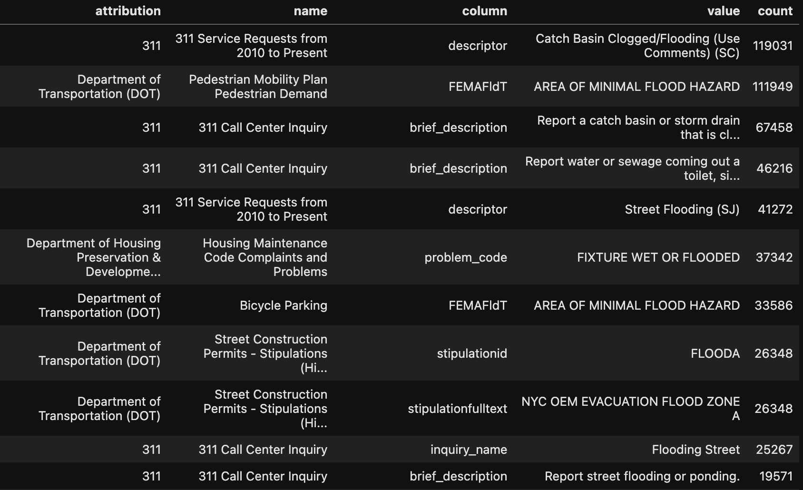

# Flood Data for New York City: A Comprehensive Inventory on NYC Open Data
Author: Mark Bauer

### Table of Contents
* [Introduction](#Introduction)
* [Dataset Summary Statistics](#Dataset-Summary-Statistics)
* [Dataset Descriptions](#Dataset-Descriptions)
    * [Flood Hazard Layers](#Flood-Hazard-Layers)
    * [Flood-Related Datasets](#Flood-Related-Datasets)
    * [Unconventional Datasets](#Unconventional-Datasets)
* [Say Hello!](#Say-Hello)
* [Appendix](#Appendix)

# Introduction
This project has three primary goals:

1) Provide the most comprehensive catalog ever of flood-related datasets from NYC Open Data
2) To search for new flood-related datasets
3) Analyze popular flood-related datasets from NYC Open Data

First, I analyzed the datasets with the highest download counts and page views to understand which flood-related resources are most in demand for research and policy-making. The methodology and findings of this analysis are documented in the [metadata-analysis](https://github.com/mebauer/nyc-flood-data/blob/main/notebooks/metadata-analysis.ipynb) notebook, focusing on open-source and reproducible workflows. While some of these statistics can be influenced, they may still provide valuable insights into dataset usage and interest.

Second, and I suspect the most exciting part, I conducted an extensive search for flood datasets across the entire NYC Open Data platform. This was done by searching for the keyword "flood" in all available datasets, which helps uncover hidden or less obvious resources that may not be immediately recognized as flood-related. The search process and its results are detailed in the [search.py](https://github.com/mebauer/nyc-flood-data/blob/main/scripts/search.py) Python script, and the analysis is documented in the [dataset-analysis](https://github.com/mebauer/nyc-flood-data/blob/main/notebooks/dataset-analysis.ipynb) notebook. The final results are stored in the [results](https://github.com/mebauer/nyc-flood-data/tree/main/results) CSV file.

Here’s what the results CSV looks like:

Figure xx: Screenshot of the results CSV, generated by searching for the keyword "flood" across the entire NYC Open Data platform. The "value" column contains instances of the keyword "flood," and the "count" column indicates the number of occurrences of each value.

The flood datasets are categorized into three groups for easier navigation:

- **Flood Hazard Layers:** These datasets provide direct information about areas at risk of flooding. They are essential for assessing flood risk and guiding flood mitigation and planning.
- **Flood-Related Datasets:** These datasets capture the infrastructure and features that contribute to flood management, resilience, mitigation, and urban response to flooding.
- **Unconventional Datasets Related to Flooding:** These datasets provide non-traditional but highly valuable data sources that can offer unique insights into urban flooding and resilience.

Tables summarizing the download counts and page views of the most popular datasets are presented below, followed by a comprehensive inventory of flood-related datasets available on NYC Open Data, including those identified through the "flood" search. In the Appendix, you’ll find tables detailing the number of rows per dataset that contain the keyword "flood." The full workflow for data analysis can be found in the [datasets-analysis](https://github.com/mebauer/nyc-flood-data/blob/main/notebooks/dataset-analysis.ipynb) notebook.

# Dataset Summary Statistics
Table xx: Top 10 flood-related datasets by total downloads per day on NYC Open Data.
|   rank | name                                                                                       | id        | created_date   |   download_count |   download_per_day |
|-------:|:-------------------------------------------------------------------------------------------|:----------|:---------------|-----------------:|-------------------:|
|      1 | Hurricane Evacuation Centers (Map)                                                         | ayer-cga7 | 2022-08-01     |           230896 |             248.81 |
|      2 | Citywide Catch Basins                                                                      | 2w2g-fk3i | 2025-02-04     |              319 |              31.9  |
|      3 | Sandy Inundation Zone                                                                      | uyj8-7rv5 | 2015-11-09     |            20293 |               5.99 |
|      4 | NYC Stormwater Flood Maps                                                                  | 9i7c-xyvv | 2024-07-03     |              916 |               4.05 |
|      5 | New York City's Flood Vulnerability Index                                                  | mrjc-v9pm | 2024-03-06     |              970 |               2.81 |
|      6 | New York City Climate Projections: Temperature and Precipitation                           | hmdk-eidg | 2024-01-18     |             1103 |               2.81 |
|      7 | New York City Climate Projections: Extreme Events and Sea Level Rise                       | 38ps-fnsg | 2024-02-13     |              981 |               2.67 |
|      8 | Building Elevation and Subgrade (BES)                                                      | bsin-59hv | 2023-09-12     |             1157 |               2.22 |
|      9 | NYC Climate Budgeting Report: Climate Alignment Assessment and Capital Climate Investments | c99a-c5ux | 2024-05-15     |              597 |               2.17 |
|     10 | Land Cover Raster Data (2017) – 6in Resolution                                             | he6d-2qns | 2018-12-07     |             4853 |               2.15 |
  
 

Table xx: Top 10 flood-related datasets by total page views per day on NYC Open Data.
|   rank | name                                          | id        | created_date   |   page_views_per_day |   page_views_total |   page_views_last_week |   page_views_last_month |
|-------:|:----------------------------------------------|:----------|:---------------|---------------------:|-------------------:|-----------------------:|------------------------:|
|      1 | Sandy Inundation Zone                         | uyj8-7rv5 | 2015-11-09     |                18.68 |              63218 |                    185 |                     727 |
|      2 | NYC Stormwater Flood Maps                     | 9i7c-xyvv | 2024-07-03     |                11.23 |               2539 |                     84 |                     387 |
|      3 | Hurricane Evacuation Centers (Map)            | ayer-cga7 | 2022-08-01     |                11.18 |              10376 |                     41 |                     155 |
|      4 | DEP Green Infrastructure                      | h3ce-uahi | 2025-01-29     |                10    |                160 |                     45 |                     160 |
|      5 | New York City's Flood Vulnerability Index Map | 4vym-qrg3 | 2024-03-06     |                 9.65 |               3328 |                    107 |                     396 |
|      6 | 1 foot Digital Elevation Model (DEM)          | dpc8-z3jc | 2013-08-09     |                 9.34 |              39309 |                    154 |                     719 |
|      7 | Citywide Catch Basins                         | 2c5m-rke8 | 2025-02-04     |                 9.2  |                 92 |                     39 |                      92 |
|      8 | New York City's Flood Vulnerability Index     | mrjc-v9pm | 2024-03-06     |                 9.14 |               3153 |                    112 |                     326 |
|      9 | Building Elevation and Subgrade (BES)         | bsin-59hv | 2023-09-12     |                 7.31 |               3807 |                     96 |                     354 |
|     10 | Citywide Catch Basins                         | 2w2g-fk3i | 2025-02-04     |                 7.3  |                 73 |                     30 |                      73 |

 

Table xx: Top 10 flood-related datasets by total downloads and page views per day on NYC Open Data.
|   rank | name                                                             | id        | created_date   |   downloads_and_views_per_day |   downloads_and_views |
|-------:|:-----------------------------------------------------------------|:----------|:---------------|------------------------------:|----------------------:|
|      1 | Hurricane Evacuation Centers (Map)                               | ayer-cga7 | 2022-08-01     |                        259.99 |                241272 |
|      2 | Citywide Catch Basins                                            | 2w2g-fk3i | 2025-02-04     |                         39.2  |                   392 |
|      3 | Sandy Inundation Zone                                            | uyj8-7rv5 | 2015-11-09     |                         24.67 |                 83511 |
|      4 | NYC Stormwater Flood Maps                                        | 9i7c-xyvv | 2024-07-03     |                         15.29 |                  3455 |
|      5 | New York City's Flood Vulnerability Index                        | mrjc-v9pm | 2024-03-06     |                         11.95 |                  4123 |
|      6 | 1 foot Digital Elevation Model (DEM)                             | dpc8-z3jc | 2013-08-09     |                         10.89 |                 45833 |
|      7 | DEP Green Infrastructure                                         | h3ce-uahi | 2025-01-29     |                         10.38 |                   166 |
|      8 | Citywide Catch Basins                                            | 2c5m-rke8 | 2025-02-04     |                          9.7  |                    97 |
|      9 | New York City's Flood Vulnerability Index Map                    | 4vym-qrg3 | 2024-03-06     |                          9.65 |                  3329 |
|     10 | New York City Climate Projections: Temperature and Precipitation | hmdk-eidg | 2024-01-18     |                          9.61 |                  3775 |

# Dataset Descriptions
## Flood Hazard Layers
These datasets provide direct information about areas at risk of flooding. They are essential for assessing flood risk and guiding flood mitigation and planning.
| Dataset | Description |
| :-------- | :---------- |
| [Sandy Inundation Zone](https://data.cityofnewyork.us/Environment/Sandy-Inundation-Zone/uyj8-7rv5) | Areas of New York City that were flooded as a result of Hurricane Sandy. |
| [NYC Stormwater Flood Maps](https://data.cityofnewyork.us/Environment/NYC-Stormwater-Flood-Maps/9i7c-xyvv) | A collection of citywide Geographic Information System (GIS) layers that show areas of potential flooding scenarios under varying sea level rise conditions. Please see the New York City Stormwater Resiliency Plan for more information about the methodology applied to develop the maps. |
| [Hurricane Inundation by Evacuation Zone](https://data.cityofnewyork.us/Environment/Hurricane-Inundation-by-Evacuation-Zone/uk9f-6y9n) | These inundation areas are based on the National Hurricane Center’s 2020 SLOSH (Sea Lake and Overland Surge from Hurricanes) Model for the NE1 basin post-processed to a 10 meter resolution. The data used assumes that the storm surge will occur at high tide. The Storm surge inundation data then used to develop New York City’s Hurricane Evacuation Zones. |
| [Hurricane Inundation by Evacuation Zones (Map)](https://data.cityofnewyork.us/Environment/Hurricane-Inundation-by-Evacuation-Zone-Map-/2234-9r2y) | Hurricane Inundation by Evacuation Zones Map. See above. |
| [Sea Level Rise Maps (2020s 100-year Floodplain](https://data.cityofnewyork.us/Environment/Sea-Level-Rise-Maps-2020s-100-year-Floodplain-/ezfn-5dsb) | This is the 100-Year Floodplain for the 2020s based on FEMA's Preliminary Work Map data and the New York Panel on Climate Change's 90th Percentile Projects for Sea-Level Rise (11 inches). Please see the Disclaimer PDF for more information. Data Provided by the Mayor's Office of Long-Term Planning and Sustainability (OLTPS) on behalf of CUNY Institute for Sustainable Cities (CISC) and the New York Panel on Climate Change (NPCC). |
| [Sea Level Rise Maps (2020s 500-year Floodplain)](https://data.cityofnewyork.us/Environment/Sea-Level-Rise-Maps-2020s-500-year-Floodplain-/ajyu-7sgg) | This is the 500-Year Floodplain for the 2020s based on FEMA's Preliminary Work Map data and the New York Panel on Climate Change's 90th Percentile Projects for Sea-Level Rise (11 inches). Please see the Disclaimer PDF for more information. Data Provided by the Mayor's Office of Long-Term Planning and Sustainability (OLTPS) on behalf of CUNY Institute for Sustainable Cities (CISC) and the New York Panel on Climate Change (NPCC). |
| [Sea Level Rise Maps (2050s 100-year Floodplain](https://data.cityofnewyork.us/Environment/Sea-Level-Rise-Maps-2050s-100-year-Floodplain-/hbw8-2bah) | This is the 100-Year Floodplain for the 2050s based on FEMA's Preliminary Work Map data and the New York Panel on Climate Change's 90th Percentile Projects for Sea-Level Rise (31 inches). Please see the Disclaimer PDF for more information. Data Provided by the Mayor's Office of Long-Term Planning and Sustainability (OLTPS) on behalf of CUNY Institute for Sustainable Cities (CISC) and the New York Panel on Climate Change (NPCC). |
| [Sea Level Rise Maps (2050s 500-year Floodplain)](https://data.cityofnewyork.us/Environment/Sea-Level-Rise-Maps-2050s-500-year-Floodplain-/qwca-zqw3) | This is the 500-Year Floodplain for the 2050s based on FEMA's Preliminary Work Map data and the New York Panel on Climate Change's 90th Percentile Projects for Sea-Level Rise (31 inches). Please see the Disclaimer PDF for more information. Data Provided by the Mayor's Office of Long-Term Planning and Sustainability (OLTPS) on behalf of CUNY Institute for Sustainable Cities (CISC) and the New York Panel on Climate Change (NPCC). |
| [2050s Mean Sea Level](https://data.cityofnewyork.us/Environment/2050s-Mean-Sea-Level/3vjp-ybhy) | 2050s Future Mean Sea Level projections released by the NPCC March 2019. |
| [2080s Mean Sea Level](https://data.cityofnewyork.us/Environment/2080s-Mean-Sea-Level/cyvg-fsk8) | 2080s Future Mean Sea Level projections released by the NPCC March 2019. |
| [2100s Mean Sea Level](https://data.cityofnewyork.us/Environment/2100s-Mean-Sea-Level/q7rf-ks4h) | 2100s Future Mean Sea Level projections released by the NPCC March 2019. |
| [2020s Mean Monthly High Water](https://data.cityofnewyork.us/Environment/2020s-Mean-Monthly-High-Water/ebsy-4b6x) | 2020s Future Mean Monthly High Water (MMHW) projections released by the NPCC March 2019. |
| [2050s Mean Monthly High Water](https://data.cityofnewyork.us/Environment/2050s-Mean-Monthly-High-Water/p8e8-yh4m) | 2050s Future Mean Monthly High Water (MMHW) projections released by the NPCC March 2019. |
| [2080s Mean Monthly High Water](https://data.cityofnewyork.us/Environment/2080s-Mean-Monthly-High-Water/amfa-s2y8) | 2080s Future Mean Monthly High Water (MMHW) projections released by the NPCC March 2019. |
| [2100s Mean Monthly High Water](https://data.cityofnewyork.us/Environment/2100s-Mean-Monthly-High-Water/mzds-2cdc) | 2100s Future Mean Monthly High Water (MMHW) projections released by the NPCC March 2019. |

## Flood-Related Datasets
These datasets capture the infrastructure and features that contribute to flood management, resilience, and urban response to flooding.
| Dataset | Description |
| :-------- | :---------- |
| [Hurricane Evacuation Zones](https://data.cityofnewyork.us/Public-Safety/Hurricane-Evacuation-Zones/uihr-hn7s) | Hurricane Evacuation Zones are determined by New York City Emergency Management and represent varying threat levels of coastal flooding resulting from storm surge. Hurricane evacuation zones should not be confused with flood insurance risk zones, which are designated by FEMA and available in the form of Flood Insurance Rate Maps (FIRMs). |
| [Hurricane Evacuation Centers](https://data.cityofnewyork.us/Public-Safety/Hurricane-Evacuation-Centers/p5md-weyf/about_data) | This dataset shows hurricane evacuation centers. Persons requiring shelter during a hurricane are processed at a hurricane evacuation center and then transported to a hurricane shelter. In the event of a hurricane, the status of these hurricane evacuation centers should be confirmed at www.nyc.gov or by calling 311. |
| [Hurricane Evacuation Centers (Map)](https://data.cityofnewyork.us/Public-Safety/Hurricane-Evacuation-Centers-Map-/ayer-cga7) | Hurricane Evacuation Centers Map. See above. |
| [New York City's Flood Vulnerability Index](https://data.cityofnewyork.us/Environment/New-York-City-s-Flood-Vulnerability-Index/mrjc-v9pm) | The Flood Vulnerability Index (FVI) assesses the distribution of vulnerability to flooding across NYC in order to guide flood resilience policies and programs. Vulnerability contains three components: exposure to a hazard, susceptibility to harm from the exposure, and capacity to recover (Cutter et al., 2009). There are six hazard-specific FVIs, one for each of the six different flood hazard scenarios, which include current and two future storm surge scenarios and current and two future tidal flooding scenarios. Exposures vary for different types of flooding and different scenarios within each flood type. |
| [New York City's Flood Vulnerability Index Map](https://data.cityofnewyork.us/Environment/New-York-City-s-Flood-Vulnerability-Index-Map/4vym-qrg3) | The Flood Vulnerability Index (FVI) Map. See above. |
| [DEP Green Infrastructure](https://data.cityofnewyork.us/Environment/DEP-Green-Infrastructure/spjh-pz7h) | NYC Green Infrastructure Program initiatives. Green infrastructure (GI) collects stormwater from streets, sidewalks, and other hard surfaces before it can enter the sewer system or cause local flooding. The GI practice data contained in this dataset includes the location, program area, status, and type of GI. |
| [DEP Green Infrastructure (Map)](https://data.cityofnewyork.us/Environment/DEP-Green-Infrastructure/h3ce-uahi) | DEP Green Infrastructure Map. See above. |
| [Citywide Outfalls](https://data.cityofnewyork.us/Environment/Citywide-Outfalls/8rjn-kpsh/about_data) | Citywide Outfalls. |
| [Citywide Outfalls](https://data.cityofnewyork.us/Environment/Citywide-Outfalls/b9ze-z4u4) | Citywide Outfalls Map. |
| [Citywide Catch Basins](https://data.cityofnewyork.us/Environment/Citywide-Catch-Basins/2w2g-fk3i/about_data) | NYCDEP Citywide Catch Basins. Catch basins are an important part of New York City’s 7,500-mile sewer network. They are connected to underground pipes that channel stormwater from the street to one of DEP’s 14 wastewater resource recovery facilities, or directly into our surrounding waterbodies. DEP cleans and maintains over 150,000 catch basins citywide. |
| [Citywide Catch Basins (Map)](https://data.cityofnewyork.us/Environment/Citywide-Catch-Basins/2c5m-rke8) | Citywide Catch Basics Map. See above. |
| [Municipal Separate Storm Sewer System (MS4) Data](https://data.cityofnewyork.us/Environment/Municipal-Separate-Storm-Sewer-System-MS4-Data/j57c-rqtq/about_data) | New York City’s Municipal Separate Storm Sewer System (MS4) Stormwater Management Program is a multiagency effort led by the Department of Environmental Protection (DEP) to reduce pollution in stormwater runoff in the MS4 Area of NYC. This MS4 Map represents the known MS4 outfalls and drainage areas as of August 1, 2020 and provides additional data relevant to the MS4 Permit. The MS4 map only shows areas draining to the Municipal Separate Storm Sewer System. DEP also maintains combined sewer and sanitary sewer systems; these service area delineations are not represented on this map. |
| [Building Elevation and Subgrade (BES)](https://data.cityofnewyork.us/City-Government/Building-Elevation-and-Subgrade-BES-/bsin-59hv) | The Building Elevation and Subgrade data contains New York City building centroids derived from the Department of Building's (DOB) February 26th, 2022 building footprint dataset. Each record contains a grade and first floor measurement for each building (recorded as feet above sea-level in the NADV88 vertical datum) and indicates if subgrade space exists. DCP contracted with an external data vendor to generate a single point, or centroid, that represented the location of the center of every building recorded in the DOB dataset. The dataset excluded the footprints of small accessory buildings such as sheds. Each row within the dataset represents one building centroid, and records the X and Y coordinates of that centroid in the NAD 1983 coordinate system. |
| [Building Elevation and Subgrade (BES) - Map](https://data.cityofnewyork.us/City-Government/Building-Elevation-and-Subgrade-BES-Map/nmzg-6q5g) | The Building Elevation and Subgrade Map. See above. |
| [Hazard Mitigation Plan - Mitigation Actions Database](https://data.cityofnewyork.us/City-Government/Hazard-Mitigation-Plan-Mitigation-Actions-Database/veqt-eu3t) | New York City’s comprehensive effort to reduce or eliminate potential losses from the hazards described in the Hazard Specific section of the website. The map includes existing and completed mitigation actions that will minimize the effects of a hazard event on New York City’s population, economy, property, building stock, and infrastructure. It is the result of a coordinated effort by 46 New York City agencies and partners to develop and implement a broad range of inventive and effective ways to mitigate hazards. |
| [Hazard Mitigation Plan – Mitigation Actions Database (points)](https://data.cityofnewyork.us/City-Government/Hazard-Mitigation-Plan-Mitigation-Actions-Database/t7k8-wj6b) | New York City’s comprehensive effort to reduce or eliminate potential losses from the hazards described in the Hazard Specific section of the website. The map includes existing and completed mitigation actions that will minimize the effects of a hazard event on New York City’s population, economy, property, building stock, and infrastructure. It is the result of a coordinated effort by 46 New York City agencies and partners to develop and implement a broad range of inventive and effective ways to mitigate hazards. |
| [Hazard Mitigation Plan - Mitigation Actions Database (Lines)](https://data.cityofnewyork.us/City-Government/Hazard-Mitigation-Plan-Mitigation-Actions-Database/hqhh-iv7p) | New York City’s comprehensive effort to reduce or eliminate potential losses from the hazards described in the Hazard Specific section of the website. The map includes existing and completed mitigation actions that will minimize the effects of a hazard event on New York City’s population, economy, property, building stock, and infrastructure. It is the result of a coordinated effort by 46 New York City agencies and partners to develop and implement a broad range of inventive and effective ways to mitigate hazards. |
| [Hazard Mitigation Plan - Mitigation Actions Database (Polygons)](https://data.cityofnewyork.us/City-Government/Hazard-Mitigation-Plan-Mitigation-Actions-Database/cj2p-e3ej) | New York City’s comprehensive effort to reduce or eliminate potential losses from the hazards described in the Hazard Specific section of the website. The map includes existing and completed mitigation actions that will minimize the effects of a hazard event on New York City’s population, economy, property, building stock, and infrastructure. It is the result of a coordinated effort by 46 New York City agencies and partners to develop and implement a broad range of inventive and effective ways to mitigate hazards. |
| [1 foot Digital Elevation Model (DEM)](https://data.cityofnewyork.us/City-Government/1-foot-Digital-Elevation-Model-DEM-/dpc8-z3jc) | NYC 1foot Digital Elevation Model: A bare-earth, hydro-flattened, digital-elevation surface model derived from 2010 Light Detection and Ranging (LiDAR) data. Surface models are raster representations derived by interpolating the LiDAR point data to produce a seamless gridded elevation data set. A Digital Elevation Model (DEM) is a surface model generated from the LiDAR returns that correspond to the ground with all buildings, trees and other above ground features removed. The cell values represent the elevation of the ground relative to sea level. The DEM was generated by interpolating the LiDAR ground points to create a 1 foot resolution seamless surface. Cell values correspond to the ground elevation value (feet) above sea level. A proprietary approach to surface model generation was developed that reduced spurious elevation values in areas where there were no LiDAR returns, primarily beneath buildings and over water. This was combined with a detailed manual QA/QC process, with emphasis on accurate representation of docks and bare-earth within 2000ft of the water bodies surrounding each of the five boroughs. |
| [1 foot Digital Elevation Model (DEM) Integer Raster](https://data.cityofnewyork.us/City-Government/1-foot-Digital-Elevation-Model-DEM-Integer-Raster/7kuu-zah7/about_data) | A bare-earth, hydro-flattened, digital-elevation surface model derived from 2010 Light Detection and Ranging (LiDAR) data. Surface models are raster representations derived by interpolating the LiDAR point data to produce a seamless gridded elevation data set. A Digital Elevation Model (DEM) is a surface model generated from the LiDAR returns that correspond to the ground with all buildings, trees and other above ground features removed. The cell values represent the elevation of the ground relative to sea level. The DEM was generated by interpolating the LiDAR ground points to create a 1 foot resolution seamless surface. Cell values correspond to the ground elevation value (feet) above sea level. A proprietary approach to surface model generation was developed that reduced spurious elevation values in areas where there were no LiDAR returns, primarily beneath buildings and over water. This was combined with a detailed manual QA/QC process, with emphasis on accurate representation of docks and bare-earth within 2000ft of the water bodies surrounding each of the five boroughs. |
| [Land Cover Raster Data (2017) – 6in Resolution](https://data.cityofnewyork.us/Environment/Land-Cover-Raster-Data-2017-6in-Resolution/he6d-2qns) | A 6-in resolution 8-class land cover dataset derived from the 2017 Light Detection and Ranging (LiDAR) data capture. This dataset was developed as part of an updated urban tree canopy assessment and therefore represents a ''top-down" mapping perspective in which tree canopy overhanging features is assigned to the tree canopy class. The eight land cover classes mapped were: (1) Tree Canopy, (2) Grass\Shrubs, (3) Bare Soil, (4) Water, (5) Buildings, (6) Roads, (7) Other Impervious, and (8) Railroads. The primary sources used to derive this land cover layer were 2017 LiDAR (1-ft post spacing) and 2016 4-band orthoimagery (0.5-ft resolution). |
| [Topobathymetric LiDAR Data (2017)](https://data.cityofnewyork.us/City-Government/Topobathymetric-LiDAR-Data-2017-/7sc8-jtbz/about_data) | Topographic and bathymetric LiDAR data was collected for New York City in 2017. Topographic data was collected for the entire city, plus an additional 100 meter buffer, using a Leica ALS80 sensor equipped to capture at least 8 pulse/m2. Dates of capture for topographic data were between 05/03/2017 and 05/17/2017 during 50% leaf-off conditions. Bathymetric data was collected in select areas of the city (where bathymetric data capture was expected) using a Riegl VQ-880-G sensor equipped to capture approximately 15 pulses/m2 (1.5 Secchi depths). |
| [DEP's Citywide Parcel-Based Impervious Area GIS Study](https://data.cityofnewyork.us/City-Government/DEP-s-Citywide-Parcel-Based-Impervious-Area-GIS-St/uex9-rfq8) | NOTE: This file includes data for all 5 boroughs and has a size of 4.60 GB. Individual borough files are available for download from the metadata attachments section. Citywide Geographic Information System (GIS) land cover layer that displays land cover classification, plus pervious and impervious area and percentage at the parcel level, separated into 5 geodatabases, one per borough. DEP hosted a webinar on this study on June 23, 2020. A recording of the webinar, plus a PDF of the webinar presentation, accompany this dataset and are available for download. This citywide parcel-level impervious area GIS layer was developed by the City of New York to support stormwater-related planning, and is provided solely for informational purposes. The accuracy of the data should be independently verified for any other purpose. |
| [NYC Planimetric Database: Hydrography](https://data.cityofnewyork.us/Environment/NYC-Planimetric-Database-Hydrography/drh3-e2fd) | Planimetric basemap layer containing hydrography. |
| [NYC Planimetric Database: Hydrography Structures](https://data.cityofnewyork.us/City-Government/NYC-Planimetric-Database-Hydrography-Structures/53au-zf7x) | Planimetric basemap layer containing hydrography structures. |
| [New York City Climate Projections: Extreme Events and Sea Level Rise](https://data.cityofnewyork.us/Environment/New-York-City-Climate-Projections-Extreme-Events-a/38ps-fnsg/about_data) | This report includes updated changes in extreme events (e.g., hot days, days with heavy rainfall, heat waves) for the 2030s, 2050s and 2080s; and sea level rise projections for the 2030s, 2050s, 2080s, 2100 and 2150 for the New York City region, based on those developed for the IPCC 6th Assessment report. The sea level rise projections are based on the CMIP6 models and SSP framework, and also incorporate advances in process understanding, improved and lengthened observational records, and improved ice-sheet modeling. |
| [New York City Climate Projections: Temperature and Precipitation](https://data.cityofnewyork.us/Environment/New-York-City-Climate-Projections-Temperature-and-/hmdk-eidg/about_data) | Temperature and precipitation projections for NYC reported by the New York City Panel on Climate Change (NPCC). |

## Unconventional Datasets Related to Flooding
These datasets provide non-traditional but highly valuable data sources that can offer unique insights into urban flooding and resilience.
| Dataset | Description |
| :-------- | :---------- |
| [311 Service Requests from 2010 to Present](https://data.cityofnewyork.us/Social-Services/311-Service-Requests-from-2010-to-Present/erm2-nwe9/about_data) | All 311 Service Requests from 2010 to present. This information is automatically updated daily. |
| [Street Construction Permits (2022-Present)](https://data.cityofnewyork.us/Transportation/Street-Construction-Permits-2022-Present-/tqtj-sjs8/about_data) | DOT issues over 150 different types of sidewalk and roadway construction permits to utilities, contractors, government agencies and homeowners. Permits cover activities such as street openings, sidewalk construction and installing canopies over sidewalks. The core permit data, including permittee, type of permit, date issued, location. |
| [Street Construction Permits (2013-2021)](https://data.cityofnewyork.us/Transportation/Street-Construction-Permits-2013-2021-/c9sj-fmsg/about_data) | DOT issues over 150 different types of sidewalk and roadway construction permits to utilities, contractors, government agencies and homeowners. Permits cover activities such as street openings, sidewalk construction and installing canopies over sidewalks. The core permit data, including permittee, type of permit, date issued, location. |
| [DOB Job Application Filings](https://data.cityofnewyork.us/Housing-Development/DOB-Job-Application-Filings/ic3t-wcy2/about_data) | This dataset contains all job applications submitted through the Borough Offices, through eFiling, or through the HUB, which have a "Latest Action Date" since January 1, 2000. This dataset does not include jobs submitted through DOB NOW. See the DOB NOW: Build – Job Application Filings dataset for DOB NOW jobs. |
| [Incidents Responded to by Fire Companies](https://data.cityofnewyork.us/Public-Safety/Incidents-Responded-to-by-Fire-Companies/tm6d-hbzd/about_data) | This dataset contains detailed information on incidents handled by FDNY Fire (non-EMS) units and includes fire, medical and non-fire emergencies. The data is collected in the New York Fire Incident Reporting System (NYFIRS), which is structured by the FDNY to provide data to the National Fire Incident Reporting System (NFIRS). NFIRS is a modular all-incident reporting system designed by the U.S. Fire Administration. After responding to an incident, FDNY officers complete one or more of the NFIRS modules, depending upon the type of incident. The information in these modules describes the kind of incident responded to, where it occurred, the resources used to mitigate it. Although NFIRS was designed specifically to understand the nature and causes of fire, as well as civilian fire casualties and firefighter injuries, it has been expanded to collect basic information on all incidents to which fire units respond. |
| [NYCEM Emergency Notifications](https://data.cityofnewyork.us/Public-Safety/NYCEM-Emergency-Notifications/8vv7-7wx3/about_data) | Messages sent with information about emergency events and important City services. |
| [NYC Climate Budgeting Report: Climate Alignment Assessment and Capital Climate Investments](https://data.cityofnewyork.us/City-Government/NYC-Climate-Budgeting-Report-Climate-Alignment-Ass/c99a-c5ux/about_data) | This dataset rates all projects in the capital budget with over $50,000 with their climate alignment and categorizes investments that are related to climate. Amounts are in thousands. This dataset will be updated once a year during the Executive Budget. |
| [Register of Community Board Budget Requests](https://data.cityofnewyork.us/City-Government/Register-of-Community-Board-Budget-Requests/vn4m-mk4t/about_data) | This dataset reports each of the projects and programs requested by the City’s 59 community boards. The Register is the charter mandated product of a dynamic and cyclical budget process for the 59 community boards. The community boards consult with agencies on the capital and expense needs of the district. After consulting, each community board develops and votes separate priorities for up to 40 capital and 25 expense budget requests which the agencies review and respond to in the Register of Community Board Requests for the Preliminary Budget in January. The Mayor’s Office of Management and Budget (OMB) reviews these same budget requests and updates the responses for the Executive and Adopted Budgets. This dataset is updated three times per year after publication of the Preliminary, Executive and Adopted Budget, usually in January, April and June respectively. |
| [Capital Projects Dashboard - Citywide Budget and Schedule](https://data.cityofnewyork.us/City-Government/Capital-Projects-Dashboard-Citywide-Budget-and-Sch/fb86-vt7u/about_data) | All major capital infrastructure projects with a committed budget. Financial information and agency schedule details for each project are joined via FMS ID. Only projects in the design phase or later have project schedules displayed. This dataset is part of the Capital Projects Dashboard. |
| [NYC Council Constituent Services](https://data.cityofnewyork.us/City-Government/NYC-Council-Constituent-Services/b9km-gdpy/about_data) | The dataset comes from CouncilStat, which is used by many NYC Council district offices to enter and track constituent cases that can range from issues around affordable housing, to potholes and pedestrian safety. This dataset aggregates the information that individual staff have input. However, district staffs handle a wide range of complex issues. Each offices uses the program differently, and thus records cases, differently and so comparisons between accounts may be difficult. Not all offices use the program. |

# Say Hello!
Contact information:  
Twitter: [markbauerwater](https://twitter.com/markbauerwater)   
LinkedIn: [markebauer](https://www.linkedin.com/in/markebauer/)  
GitHub: [mebauer](https://github.com/mebauer)

# Appendix

Table xx: Number of rows with word "flood" by agency, dataset, column name, and column value.
|    | attribution                                            | name                                                    | column                                | value                                                                                                                                                                                                                                                                                                                                                                                                                                                                                                                                                                                                                                                                                                                                                                                                                                                                                                                                      |   count |
|---:|:-------------------------------------------------------|:--------------------------------------------------------|:--------------------------------------|:-------------------------------------------------------------------------------------------------------------------------------------------------------------------------------------------------------------------------------------------------------------------------------------------------------------------------------------------------------------------------------------------------------------------------------------------------------------------------------------------------------------------------------------------------------------------------------------------------------------------------------------------------------------------------------------------------------------------------------------------------------------------------------------------------------------------------------------------------------------------------------------------------------------------------------------------|--------:|
|  0 | 311                                                    | 311 Service Requests from 2010 to Present               | descriptor                            | Catch Basin Clogged/Flooding (Use Comments) (SC)                                                                                                                                                                                                                                                                                                                                                                                                                                                                                                                                                                                                                                                                                                                                                                                                                                                                                           |  119031 |
|  1 | Department of Transportation (DOT)                     | Pedestrian Mobility Plan Pedestrian Demand              | FEMAFldT                              | AREA OF MINIMAL FLOOD HAZARD                                                                                                                                                                                                                                                                                                                                                                                                                                                                                                                                                                                                                                                                                                                                                                                                                                                                                                               |  111949 |
|  2 | 311                                                    | 311 Call Center Inquiry                                 | brief_description                     | Report a catch basin or storm drain that is clogged, blocked, or flooded.                                                                                                                                                                                                                                                                                                                                                                                                                                                                                                                                                                                                                                                                                                                                                                                                                                                                  |   67458 |
|  3 | 311                                                    | 311 Call Center Inquiry                                 | brief_description                     | Report water or sewage coming out a toilet, sink drain, or bathtub drain as a result of heavy rainfall or flooding.                                                                                                                                                                                                                                                                                                                                                                                                                                                                                                                                                                                                                                                                                                                                                                                                                        |   46216 |
|  4 | 311                                                    | 311 Service Requests from 2010 to Present               | descriptor                            | Street Flooding (SJ)                                                                                                                                                                                                                                                                                                                                                                                                                                                                                                                                                                                                                                                                                                                                                                                                                                                                                                                       |   41272 |
|  5 | Department of Housing Preservation & Development (HPD) | Housing Maintenance Code Complaints and Problems        | problem_code                          | FIXTURE WET OR FLOODED                                                                                                                                                                                                                                                                                                                                                                                                                                                                                                                                                                                                                                                                                                                                                                                                                                                                                                                     |   37342 |
|  6 | Department of Transportation (DOT)                     | Bicycle Parking                                         | FEMAFldT                              | AREA OF MINIMAL FLOOD HAZARD                                                                                                                                                                                                                                                                                                                                                                                                                                                                                                                                                                                                                                                                                                                                                                                                                                                                                                               |   33586 |
|  7 | Department of Transportation (DOT)                     | Street Construction Permits - Stipulations (Historical) | stipulationid                         | FLOODA                                                                                                                                                                                                                                                                                                                                                                                                                                                                                                                                                                                                                                                                                                                                                                                                                                                                                                                                     |   26348 |
|  8 | Department of Transportation (DOT)                     | Street Construction Permits - Stipulations (Historical) | stipulationfulltext                   | NYC OEM EVACUATION FLOOD ZONE A                                                                                                                                                                                                                                                                                                                                                                                                                                                                                                                                                                                                                                                                                                                                                                                                                                                                                                            |   26348 |
|  9 | 311                                                    | 311 Call Center Inquiry                                 | inquiry_name                          | Flooding Street                                                                                                                                                                                                                                                                                                                                                                                                                                                                                                                                                                                                                                                                                                                                                                                                                                                                                                                            |   25267 |
| 10 | 311                                                    | 311 Call Center Inquiry                                 | brief_description                     | Report street flooding or ponding.                                                                                                                                                                                                                                                                                                                                                                                                                                                                                                                                                                                                                                                                                                                                                                                                                                                                                                         |   19571 |
| 11 | 311                                                    | 311 Service Requests for 2007                           | descriptor                            | Catch Basin Clogged/Flooding (Use Comments) (SC)                                                                                                                                                                                                                                                                                                                                                                                                                                                                                                                                                                                                                                                                                                                                                                                                                                                                                           |   17628 |
| 12 | 311                                                    | 311 Call Center Inquiry                                 | brief_description                     | Report street flooding.                                                                                                                                                                                                                                                                                                                                                                                                                                                                                                                                                                                                                                                                                                                                                                                                                                                                                                                    |   16981 |
| 13 | 311                                                    | 311 Service Requests for 2006                           | descriptor                            | Catch Basin Clogged/Flooding (Use Comments) (SC)                                                                                                                                                                                                                                                                                                                                                                                                                                                                                                                                                                                                                                                                                                                                                                                                                                                                                           |   16713 |
| 14 | 311                                                    | 311 Service Requests for 2005                           | descriptor                            | Catch Basin Clogged/Flooding (Use Comments) (SC)                                                                                                                                                                                                                                                                                                                                                                                                                                                                                                                                                                                                                                                                                                                                                                                                                                                                                           |   14980 |
| 15 | 311                                                    | 311 Service Requests for 2004                           | descriptor                            | Catch Basin Clogged/Flooding (Use Comments) (SC)                                                                                                                                                                                                                                                                                                                                                                                                                                                                                                                                                                                                                                                                                                                                                                                                                                                                                           |   14427 |
| 16 | 311                                                    | 311 Service Requests for 2008                           | descriptor                            | Catch Basin Clogged/Flooding (Use Comments) (SC)                                                                                                                                                                                                                                                                                                                                                                                                                                                                                                                                                                                                                                                                                                                                                                                                                                                                                           |   14016 |
| 17 | 311                                                    | 311 Call Center Inquiry                                 | inquiry_name                          | Street Flooding                                                                                                                                                                                                                                                                                                                                                                                                                                                                                                                                                                                                                                                                                                                                                                                                                                                                                                                            |   11285 |
| 18 | 311                                                    | 311 Service Requests for 2009                           | descriptor                            | Catch Basin Clogged/Flooding (Use Comments) (SC)                                                                                                                                                                                                                                                                                                                                                                                                                                                                                                                                                                                                                                                                                                                                                                                                                                                                                           |   10367 |
| 19 | Department of Parks and Recreation (DPR)               | Daily Tasks Park Cleaning Records                       | signname                              | X061 | Flood Triangle                                                                                                                                                                                                                                                                                                                                                                                                                                                                                                                                                                                                                                                                                                                                                                                                                                                                                                                      |   10035 |
| 20 | 311                                                    | 311 Call Center Inquiry                                 | brief_description                     | Report of street flooding Mon - Fri, 9 AM - 6 PM or Sat, 9 AM - 2 PM.                                                                                                                                                                                                                                                                                                                                                                                                                                                                                                                                                                                                                                                                                                                                                                                                                                                                      |    6642 |
| 21 | 311                                                    | 311 Call Center Inquiry                                 | inquiry_name                          | Flooding Street - During Business Hours and Saturdays                                                                                                                                                                                                                                                                                                                                                                                                                                                                                                                                                                                                                                                                                                                                                                                                                                                                                      |    6642 |
| 22 | 311                                                    | 311 Service Requests from 2010 to Present               | descriptor                            | Flood Light Lamp Out                                                                                                                                                                                                                                                                                                                                                                                                                                                                                                                                                                                                                                                                                                                                                                                                                                                                                                                       |    6615 |
| 23 | 311                                                    | 311 Call Center Inquiry                                 | inquiry_name                          | Manhole Flooding                                                                                                                                                                                                                                                                                                                                                                                                                                                                                                                                                                                                                                                                                                                                                                                                                                                                                                                           |    6072 |
| 24 | Department of City Planning (DCP)                      | Building Elevation and Subgrade (BES)                   | notes2                                | Fully Enclosed Ground floor for Apartment Lobby, Parking, or Access (includes sites with visible flood vents)                                                                                                                                                                                                                                                                                                                                                                                                                                                                                                                                                                                                                                                                                                                                                                                                                              |    4469 |
| 25 | 311                                                    | 311 Service Requests from 2010 to Present               | resolution_description                | The Department of Environmental Protection investigated this complaint and resolved the street flooding.                                                                                                                                                                                                                                                                                                                                                                                                                                                                                                                                                                                                                                                                                                                                                                                                                                   |    3835 |
| 26 | Department of Transportation (DOT)                     | Pedestrian Mobility Plan Pedestrian Demand              | FEMAFldT                              | 0.2 PCT ANNUAL CHANCE FLOOD HAZARD                                                                                                                                                                                                                                                                                                                                                                                                                                                                                                                                                                                                                                                                                                                                                                                                                                                                                                         |    3751 |
| 27 | 311                                                    | 311 Service Requests for 2008                           | descriptor                            | Street Flooding (SJ)                                                                                                                                                                                                                                                                                                                                                                                                                                                                                                                                                                                                                                                                                                                                                                                                                                                                                                                       |    3461 |
| 28 | 311                                                    | 311 Service Requests for 2007                           | descriptor                            | Street Flooding (SJ)                                                                                                                                                                                                                                                                                                                                                                                                                                                                                                                                                                                                                                                                                                                                                                                                                                                                                                                       |    3270 |
| 29 | 311                                                    | 311 Service Requests from 2010 to Present               | descriptor                            | Highway Flooding (SH)                                                                                                                                                                                                                                                                                                                                                                                                                                                                                                                                                                                                                                                                                                                                                                                                                                                                                                                      |    3189 |
| 30 | NYC Department of Transportation                       | Bus Stop Shelter                                        | FEMAFldT                              | AREA OF MINIMAL FLOOD HAZARD                                                                                                                                                                                                                                                                                                                                                                                                                                                                                                                                                                                                                                                                                                                                                                                                                                                                                                               |    3064 |
| 31 | Department of Transportation (DOT)                     | Accessible Pedestrian Signal Locations                  | FEMAFldT                              | AREA OF MINIMAL FLOOD HAZARD                                                                                                                                                                                                                                                                                                                                                                                                                                                                                                                                                                                                                                                                                                                                                                                                                                                                                                               |    2935 |
| 32 | 311                                                    | 311 Service Requests for 2009                           | descriptor                            | Street Flooding (SJ)                                                                                                                                                                                                                                                                                                                                                                                                                                                                                                                                                                                                                                                                                                                                                                                                                                                                                                                       |    2810 |
| 33 | Department of Transportation (DOT)                     | Pedestrian Mobility Plan Pedestrian Demand              | FEMAFldT                              | 0.2 PCT ANNUAL CHANCE FLOOD HAZARD,AREA OF MINIMAL FLOOD HAZARD                                                                                                                                                                                                                                                                                                                                                                                                                                                                                                                                                                                                                                                                                                                                                                                                                                                                            |    2665 |
| 34 | 311                                                    | 311 Service Requests from 2010 to Present               | descriptor                            | Flood Light Lamp Cycling                                                                                                                                                                                                                                                                                                                                                                                                                                                                                                                                                                                                                                                                                                                                                                                                                                                                                                                   |    2618 |
| 35 | 311                                                    | 311 Call Center Inquiry                                 | brief_description                     | Learn how to clean a home after a flood or sewage overflow.                                                                                                                                                                                                                                                                                                                                                                                                                                                                                                                                                                                                                                                                                                                                                                                                                                                                                |    2511 |
| 36 | Department of Transportation (DOT)                     | Seating Locations                                       | FEMAFldT                              | AREA OF MINIMAL FLOOD HAZARD, AREA OF MINIMAL FLOOD HAZARD                                                                                                                                                                                                                                                                                                                                                                                                                                                                                                                                                                                                                                                                                                                                                                                                                                                                                 |    2420 |
| 37 | Department of Environmental Protection (DEP)           | Harbor Water Quality                                    | Current Direction (Current Direction) | Flood                                                                                                                                                                                                                                                                                                                                                                                                                                                                                                                                                                                                                                                                                                                                                                                                                                                                                                                                      |    2419 |
| 38 | 311                                                    | 311 Call Center Inquiry                                 | inquiry_name                          | Sewer Backup or Flood Clean-Up                                                                                                                                                                                                                                                                                                                                                                                                                                                                                                                                                                                                                                                                                                                                                                                                                                                                                                             |    2375 |
| 39 | 311                                                    | 311 Service Requests for 2006                           | descriptor                            | Street Flooding (SJ)                                                                                                                                                                                                                                                                                                                                                                                                                                                                                                                                                                                                                                                                                                                                                                                                                                                                                                                       |    2090 |
| 40 | 311                                                    | 311 Call Center Inquiry                                 | brief_description                     | Report a storm drain that is clogged, blocked, or flooded Mon - Fri, 9 AM - 6 PM or Sat, 9 AM - 2 PM.                                                                                                                                                                                                                                                                                                                                                                                                                                                                                                                                                                                                                                                                                                                                                                                                                                      |    2078 |
| 41 | Department of Transportation (DOT)                     | City Bench Locations (Historical)                       | FEMAFldT                              | AREA OF MINIMAL FLOOD HAZARD                                                                                                                                                                                                                                                                                                                                                                                                                                                                                                                                                                                                                                                                                                                                                                                                                                                                                                               |    2030 |
| 42 | 311                                                    | 311 Service Requests for 2005                           | descriptor                            | Street Flooding (SJ)                                                                                                                                                                                                                                                                                                                                                                                                                                                                                                                                                                                                                                                                                                                                                                                                                                                                                                                       |    1899 |
| 43 | Department of Transportation (DOT)                     | Pedestrian Mobility Plan Pedestrian Demand              | FEMAFldT                              | ,0.2 PCT ANNUAL CHANCE FLOOD HAZARD                                                                                                                                                                                                                                                                                                                                                                                                                                                                                                                                                                                                                                                                                                                                                                                                                                                                                                        |    1757 |
| 44 | Business Integrity Commission                          | Trade Waste Broker Registrants                          | EMAIL                                 | kflood@astorcompany.com                                                                                                                                                                                                                                                                                                                                                                                                                                                                                                                                                                                                                                                                                                                                                                                                                                                                                                                    |    1542 |
| 45 | 311                                                    | 311 Service Requests for 2004                           | descriptor                            | Street Flooding (SJ)                                                                                                                                                                                                                                                                                                                                                                                                                                                                                                                                                                                                                                                                                                                                                                                                                                                                                                                       |    1535 |
| 46 | Department of Transportation (DOT)                     | Street Construction Permits (2022-Present)              | permitpurposecomments                 | Installation of Sanitary and Storm Sewers, Floodwall, Floodgates                                                                                                                                                                                                                                                                                                                                                                                                                                                                                                                                                                                                                                                                                                                                                                                                                                                                           |    1370 |
| 47 | 311                                                    | 311 Call Center Inquiry                                 | inquiry_name                          | Flooding Highway - Priority                                                                                                                                                                                                                                                                                                                                                                                                                                                                                                                                                                                                                                                                                                                                                                                                                                                                                                                |    1325 |
| 48 | 311                                                    | 311 Web Content - Services                              | web_keywords                          | fema, flood, insurance, primary, home, biggert, biggert-waters, FIRM, secondary, business, HFIAA, sandy, irene, superstorm, damage, house, rate, increase, premium, help, legal, document, proof, homestead, reserve fund, assessment, property, policy, risk,                                                                                                                                                                                                                                                                                                                                                                                                                                                                                                                                                                                                                                                                             |    1264 |
| 49 | 311                                                    | 311 Web Content - Services                              | web_keywords                          | emols, hurricane, huricane, evacuation, evacuate, zone, plan, surge, wave, flood, weather, rain,  storm, wind, tropical, warning, watch, snow, freeze, ice, slush, noreaster, nor, north, blizzard, coastal, reception, route, shelter, sign, prepare, ready, guide, brochure, shelter                                                                                                                                                                                                                                                                                                                                                                                                                                                                                                                                                                                                                                                     |    1264 |
| 50 | 311                                                    | 311 Web Content - Services                              | web_keywords                          | drywell, dry well, sewer, dig, permit, SD1, SD2, construction, build, storm, water, drainage, runoff, ground, sand, stormwater, runoff, groundwater, soakaway, soak pit, soil boring, test pit, riprap, cesspool, porous strata, column, flooding,  Drywell Audit Pilot Initiative, percolation, plumbing                                                                                                                                                                                                                                                                                                                                                                                                                                                                                                                                                                                                                                  |    1264 |
| 51 | 311                                                    | 311 Web Content - Services                              | web_keywords                          | highway, escalation, flooded, large, flood, water, running, traffic, ponding, collecting, street, block, road, overflow, manhole                                                                                                                                                                                                                                                                                                                                                                                                                                                                                                                                                                                                                                                                                                                                                                                                           |    1264 |
| 52 | 311                                                    | 311 Web Content - Services                              | web_keywords                          | operations, leaking, releasing, hydrant, open, water, leak, shoot, full, blast, flood, pump, wet, drip, running, run, out, force, street, leaking, block, traffic, illegal, public, pool, hose, valve, flow, johnny                                                                                                                                                                                                                                                                                                                                                                                                                                                                                                                                                                                                                                                                                                                        |    1264 |
| 53 | 311                                                    | 311 Web Content - Services                              | web_keywords                          | ready, redi, readyness, readiness, rediness, go, bag, go-bag, gobag, survival, emergency, terrorism, kit, duffel, duffell, brochure, disaster, biological, event, plan, planning, family, checklist, supply, evacuation, shelter, sheltering, disruption, weather, storm, coastal, costal, nor, easter, north, easterly, tropical, hurricane, extreme, carbon, monoxide, disease, outbreak, out, earthquake, earth, radiation, bomb, spill, pamphlet, booklet, preparedness, guide, prepare, household, code, orange, yellow, red, chatter, warning, increase, high, severe, search, elevated, billboard, dog, cat, pet, elder, elderly, disabled, handicapped, kids, elementary, students, middle, school, flood, flooding, new, ny, information, cope, preparation, flooded, water, rain, oem, nyc, heat, summer, heat illness, conserve water, cool, beat, small, pocket-sized, black, video, nycem, new york city emergency management |    1264 |
| 54 | 311                                                    | 311 Web Content - Services                              | web_keywords                          | sewer, sludge, clogged, overflow, sewage, flood, basement, flooding, water, clean, up, rain, storm, furniture, rugs, mold, damp, wet, flooded, back, damage, backup, raw, disinfect, cellar, celler                                                                                                                                                                                                                                                                                                                                                                                                                                                                                                                                                                                                                                                                                                                                        |    1264 |
| 55 | 311                                                    | 311 Web Content - Services                              | web_keywords                          | toilet, APT, bathroom, Cemusa, public, rest, locations, hours, operation, automated, automatic, john,  request, put, place, placement, installation, Cemusa , complaint, damage, damaged, not, working, dirty, flood, flooded, broken, latch, foor, lighting, graffiti, supplies, urine, piss, vomit, feces, stool, smell, filthy, flies                                                                                                                                                                                                                                                                                                                                                                                                                                                                                                                                                                                                   |    1264 |
| 56 | 311                                                    | 311 Web Content - Services                              | web_keywords                          | unsafe, construction, site, work, worksite, highway, priority, barricades, escalation, flagman, scaffolding, no, barricade, inadequate, hazard, hazzard, hazardous, dangerous, light, flood, plate                                                                                                                                                                                                                                                                                                                                                                                                                                                                                                                                                                                                                                                                                                                                         |    1264 |
| 57 | 311                                                    | 311 Web Content - Services                              | web_keywords                          | flood, waterfront                                                                                                                                                                                                                                                                                                                                                                                                                                                                                                                                                                                                                                                                                                                                                                                                                                                                                                                          |    1264 |
| 58 | 311                                                    | 311 Web Content - Services                              | web_keywords                          | blue, belt, staten, island, statan, swamp, wet, wetland, clean, environment, dep, help, volunteer, maintain, maintenance, facility, water, sewer, flood, marsh, richmond, pollution, protection                                                                                                                                                                                                                                                                                                                                                                                                                                                                                                                                                                                                                                                                                                                                            |    1264 |
| 59 | 311                                                    | 311 Web Content - Services                              | web_keywords                          | drainage, gradation, land, improper, run, off, water, slope, incline, flow, damage, ground, yard, driveway, flood, leak, wet, course, level                                                                                                                                                                                                                                                                                                                                                                                                                                                                                                                                                                                                                                                                                                                                                                                                |    1264 |

 

Table xx: Number of rows with word "flood" by agency, dataset, column name, and column value excluding 311 and DOT datasets, as these conditions dominated the table above.

|    | attribution                                            | name                                                                                       | column                                | value                                                                                                                                                                                        |   count |
|---:|:-------------------------------------------------------|:-------------------------------------------------------------------------------------------|:--------------------------------------|:---------------------------------------------------------------------------------------------------------------------------------------------------------------------------------------------|--------:|
|  0 | Department of Housing Preservation & Development (HPD) | Housing Maintenance Code Complaints and Problems                                           | problem_code                          | FIXTURE WET OR FLOODED                                                                                                                                                                       |   37342 |
|  1 | Department of Parks and Recreation (DPR)               | Daily Tasks Park Cleaning Records                                                          | signname                              | X061 Flood Triangle                                                                                                                                                                        |   10035 |
|  2 | Department of City Planning (DCP)                      | Building Elevation and Subgrade (BES)                                                      | notes2                                | Fully Enclosed Ground floor for Apartment Lobby, Parking, or Access (includes sites with visible flood vents)                                                                                |    4469 |
|  3 | NYC Department of Transportation                       | Bus Stop Shelter                                                                           | FEMAFldT                              | AREA OF MINIMAL FLOOD HAZARD                                                                                                                                                                 |    3064 |
|  4 | Department of Environmental Protection (DEP)           | Harbor Water Quality                                                                       | Current Direction (Current Direction) | Flood                                                                                                                                                                                        |    2419 |
|  5 | Business Integrity Commission                          | Trade Waste Broker Registrants                                                             | EMAIL                                 | kflood@astorcompany.com                                                                                                                                                                      |    1542 |
|  6 | Department of Records and Information Services (DORIS) | NYC Historical Vital Records: Index to Digitized Death Certificates                        | last_name                             | Flood                                                                                                                                                                                        |    1017 |
|  7 | New York City Council (NYCC)                           | NYC Council Constituent Services                                                           | DESCRIPTOR                            | Street Flooding                                                                                                                                                                              |    1011 |
|  8 | Department of City Planning (DCP)                      | Building Elevation and Subgrade (BES)                                                      | notes2                                | Commercial, Industrial or other Non-Residential Lowest Floor Active Use; Fully Enclosed Ground floor for Apartment Lobby, Parking, or Access (includes sites with visible flood vents)       |     986 |
|  9 | Department of Records and Information Services (DORIS) | NYC Historical Vital Records: Index to Digitized Marriage Certificates                     | last_name                             | Flood                                                                                                                                                                                        |     719 |
| 10 | Mayor's Office of Contract Services (MOCS)             | Vendor List by Commodity                                                                   | commodity                             | Natural Disasters (Fire, Flood, Wind, Quakes) Consulting                                                                                                                                     |     686 |
| 11 | Mayor's Office of Contract Services (MOCS)             | Vendor List by Commodity                                                                   | commodity                             | Lighting Fixtures, Outdoor: Floodlights, Spotlights, Yard Lights, and all other Weatherproof Fixtures (Except Streetlights) (Including Recycled Types)                                       |     574 |
| 12 | Office of Payroll Administration (OPA)                 | Citywide Payroll Data (Fiscal Year)                                                        | last_name                             | FLOOD                                                                                                                                                                                        |     542 |
| 13 | Department of Records and Information Services (DORIS) | NYC Historical Vital Records: Index to Digitized Birth Certificates                        | last_name                             | Flood                                                                                                                                                                                        |     525 |
| 14 | Department of Buildings (DOB)                          | DOB NOW: Build – Job Application Filings                                                   | SpecialInspectionRequirement          | Fire-Resistant Penetrations and Joints,Flood Zone Compliance (attach FEMA elevation/dry floodproofing certificate where applicable),Structural Stability – Alterations of existing buildings |     509 |
| 15 | Department of Buildings (DOB)                          | DOB Permit Issuance                                                                        | permittee_s_last_name                 | FLOOD                                                                                                                                                                                        |     487 |
| 16 | Mayor's Office of Contract Services (MOCS)             | Vendor List by Commodity                                                                   | commodity                             | Lights and Lens: Emergency, Flood, Trouble and Spotlights                                                                                                                                    |     399 |
| 17 | Department of Buildings (DOB)                          | DOB NOW: Build – Job Application Filings                                                   | SpecialInspectionRequirement          | Fire-Resistant Penetrations and Joints,Flood Zone Compliance (attach FEMA elevation/dry floodproofing certificate where applicable)                                                          |     392 |
| 18 | NYC Parks                                              | Parks Supervisor Inspections - Inspection Results                                          | Site_Name                             | Flood Triangle                                                                                                                                                                               |     354 |
| 19 | Taxi and Limousine Commission (TLC)                    | Historical Medallion Drivers – Passenger Assistance Trained 2018                           | name                                  | FLOOD,NICOLE,R                                                                                                                                                                               |     352 |
| 20 | Department of Buildings (DOB)                          | DOB NOW: Build – Job Application Filings                                                   | SpecialInspectionRequirement          | Flood Zone Compliance (attach FEMA elevation/dry floodproofing certificate where applicable)                                                                                                 |     292 |
| 21 | Fire Department of New York City (FDNY)                | Incidents Responded to by Fire Companies                                                   | incident_type_desc                    | 812 - Flood assessment                                                                                                                                                                       |     282 |
| 22 | NYC Emergency Management (NYCEM)                       | Hazard Mitigation Plan - Mitigation Actions Database                                       | Hazards Addressed                     | Flooding                                                                                                                                                                                     |     232 |
| 23 | Department of Citywide Administrative Services (DCAS)  | Civil Service List Certification                                                           | last_name                             | FLOOD                                                                                                                                                                                        |     212 |
| 24 | Department of City Planning (DCP)                      | Building Elevation and Subgrade (BES)                                                      | notes2                                | Attached Garage to Living Space; Fully Enclosed Ground floor for Apartment Lobby, Parking, or Access (includes sites with visible flood vents)                                               |     212 |
| 25 | Department of Buildings (DOB)                          | DOB Permit Issuance                                                                        | permittee_s_business_name             | H.J. FLOOD INC.                                                                                                                                                                              |     203 |
| 26 | Mayor’s Office of Management & Budget (OMB)            | Expense Budget                                                                             | Budget Code Name                      | Flood Protection - Trap Bags                                                                                                                                                                 |     169 |
| 27 | NYC Emergency Management (NYCEM)                       | Hazard Mitigation Plan - Mitigation Actions Database                                       | Hazards Addressed                     | Coastal Storms,Flooding                                                                                                                                                                      |     148 |
| 28 | Mayor’s Office of Management and Budget (OMB)          | Capital Project Detail Data - Milestones                                                   | PROJECT_DESCR                         | FLOODWATER RESILIENCY AT BWT FACILITES                                                                                                                                                       |     140 |
| 29 | Mayor’s Office of Management and Budget (OMB)          | Capital Project Detail Data - Milestones                                                   | PROJECT_DESCR                         | Replacement of Park, Highway and Flood Lights with LEDs                                                                                                                                      |     140 |
| 30 | Mayor’s Office of Management and Budget (OMB)          | Capital Project Detail Data - Milestones                                                   | PROJECT_DESCR                         | Ferry Terminal Floodproofing                                                                                                                                                                 |     140 |
| 31 | NYC Department of Transportation                       | Bus Stop Shelter                                                                           | FEMAFldT                              | 0.2 PCT ANNUAL CHANCE FLOOD HAZARD                                                                                                                                                           |     135 |
| 32 | Mayor's Office of Contract Services (MOCS)             | Vendor List by Commodity                                                                   | commodity                             | Studio Production Equipment: Backdrop Mechanisms, Floods, Posing Stools, Reflectors, Spots, Stands, Strobe Systems, etc. (See Class 285 for Lamps)                                           |     124 |
| 33 | Department of Buildings (DOB)                          | DOB NOW: Build – Job Application Filings                                                   | SpecialInspectionRequirement          | Fire-Resistant Penetrations and Joints,Flood Zone Compliance (attach FEMA elevation/dry floodproofing certificate where applicable),Mechanical Systems                                       |     124 |
| 34 | Mayor’s Office of Management and Budget (OMB)          | Capital Project Detail Data - Milestones                                                   | PROJECT_DESCR                         | FAD - FLOOD HAZARD MITIGATION                                                                                                                                                                |     120 |
| 35 | Mayor’s Office of Management and Budget (OMB)          | Capital Project Detail Data - Milestones                                                   | PROJECT_ID                            | FADFLOOD                                                                                                                                                                                     |     120 |
| 36 | Department of Buildings (DOB)                          | DOB NOW: Build – Job Application Filings                                                   | SpecialInspectionRequirement          | Flood Zone Compliance (attach FEMA elevation/dry floodproofing certificate where applicable),Mechanical Systems                                                                              |     113 |
| 37 | Mayor's Office of Operations (OPS)                     | Mayor's Management Report - Agency Performance Indicators                                  | Indicator                             | Sewer Maintenance — Catch Basin Clogged/Flooding  - % of SRs Meeting Time to First Action (6 days)                                                                                           |     110 |
| 38 | Mayor's Office of Contract Services (MOCS)             | Vendor List by Commodity                                                                   | commodity                             | Lighting Instruments: Border and Cyclorama Strip lights, Follow Spotlights, Floodlights, Special Effects Lighting, Spotlights, etc.                                                          |     105 |
| 39 | Department of Buildings (DOB)                          | DOB Permit Issuance                                                                        | superintendent_first___last_name      | JAMES FLOOD                                                                                                                                                                                  |     103 |
| 40 | Department of Buildings (DOB)                          | DOB NOW: Build – Approved Permits                                                          | Applicant Last Name                   | FLOOD                                                                                                                                                                                        |     102 |
| 41 | Office of Management and Budget (OMB)                  | NYC Climate Budgeting Report: Climate Alignment Assessment and Capital Climate Investments | Tracking Category                     | Flood Protection for Buildings                                                                                                                                                               |      99 |
| 42 | Mayor's Office of Contract Services (MOCS)             | Vendor List by Commodity                                                                   | commodity                             | Flood Control Devices, Equipment, Accessories and Parts                                                                                                                                      |      98 |
| 43 | Mayor’s Office of Management & Budget (OMB)            | Expense Budget                                                                             | Budget Code Name                      | EMERGENCY REPAIR - FLOODPLAIN                                                                                                                                                                |      96 |
| 44 | Office of Administrative Trials and Hearings (OATH)    | OATH Hearings Division Case Status                                                         | respondent_last_name                  | FLOOD                                                                                                                                                                                        |      91 |
| 45 | Department of Buildings (DOB)                          | DOB NOW: Build – Job Application Filings                                                   | SpecialInspectionRequirement          | Fire-Resistant Penetrations and Joints,Flood Zone Compliance (attach FEMA elevation/dry floodproofing certificate where applicable),Tenant Protection Plan Compliance                        |      88 |
| 46 | Mayor's Office of Contract Services (MOCS)             | Vendor List by Commodity                                                                   | commodity                             | Flood                                                                                                                                                                                        |      87 |
| 47 | New York City Council (NYCC)                           | NYC Council Constituent Services                                                           | DESCRIPTOR                            | FLOODING                                                                                                                                                                                     |      84 |
| 48 | Mayor’s Office of Management and Budget (OMB)          | Capital Project Detail Data - Milestones                                                   | PROJECT_DESCR                         | METROPOLITAN HOSPITAL FLOOD MITIGATION SYSTEM                                                                                                                                                |      84 |
| 49 | School Construction Authority (SCA)                    | Capital Project Schedules and Budgets                                                      | Project Description                   | FLOOD ELIMINATION                                                                                                                                                                            |      80 |
| 50 | Mayor's Office of Contract Services (MOCS)             | Vendor List by Commodity                                                                   | commodity                             | Flood Control Services, Marine                                                                                                                                                               |      74 |
| 51 | Department of Buildings (DOB)                          | DOB NOW: Build – Job Application Filings                                                   | SpecialInspectionRequirement          | Flood Zone Compliance (attach FEMA elevation/dry floodproofing certificate where applicable),Tenant Protection Plan Compliance                                                               |      69 |
| 52 | Department of Buildings (DOB)                          | DOB Permit Issuance                                                                        | owner_s_last_name                     | FLOOD                                                                                                                                                                                        |      66 |
| 53 | School Construction Authority (SCA)                    | Upcoming contracts to be awarded (CIP)                                                     | Upcoming Project Description          | FLOOD ELIMINATION                                                                                                                                                                            |      63 |
| 54 | Department of Parks and Recreation (DPR)               | Asset Management Parks System (AMPS) – Transaction Details                                 | par_desc                              | Bulb, Compact Fluorescent, Flood, 20 Watt = 75 Watt                                                                                                                                          |      62 |
| 55 | Mayor’s Office of Management and Budget (OMB)          | Capital Project Detail Data - Milestones                                                   | PROJECT_DESCR                         | HHC FEMA Bellevue Hospital Center Flood Protection Barrier                                                                                                                                   |      60 |
| 56 | Department of Parks and Recreation (DPR)               | Asset Management Parks System (AMPS) – Transaction Details                                 | par_desc                              | Bulb, Inncadescent, Flood, Halo, 75 Watt                                                                                                                                                     |      59 |
| 57 | Department of Buildings (DOB)                          | DOB Job Application Filings                                                                | owner_s_last_name                     | FLOOD                                                                                                                                                                                        |      59 |
| 58 | Department of Citywide Administrative Services (DCAS)  | Civil Service List (Terminated)                                                            | Last Name                             | FLOOD                                                                                                                                                                                        |      57 |
| 59 | Department of Environmental Protection (DEP)           | Harbor Water Quality                                                                       | Current Direction (Current Direction) | FLOOD                                                                                                                                                                                        |      56 |
